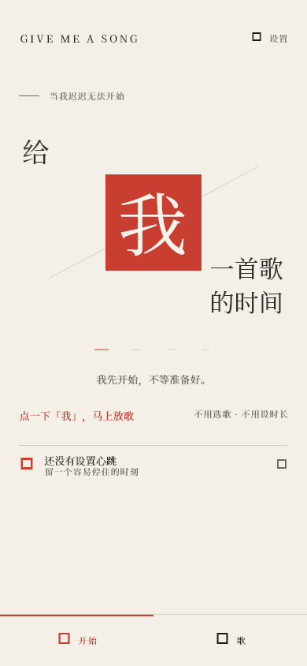
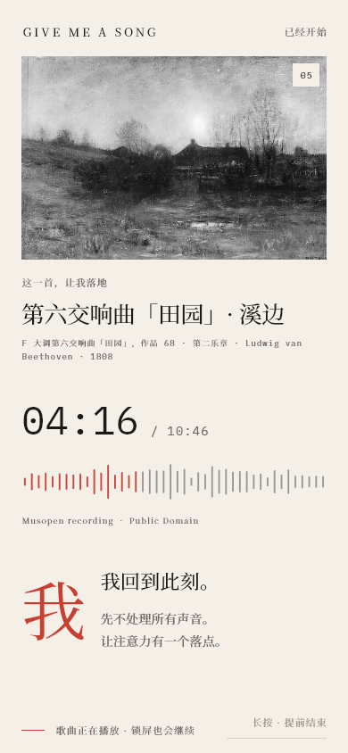
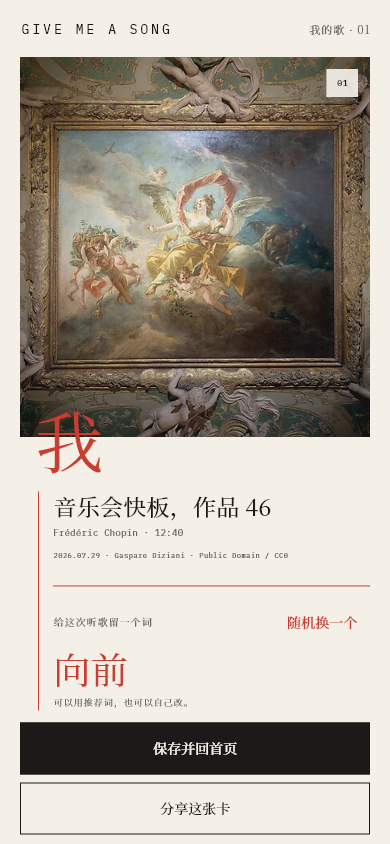
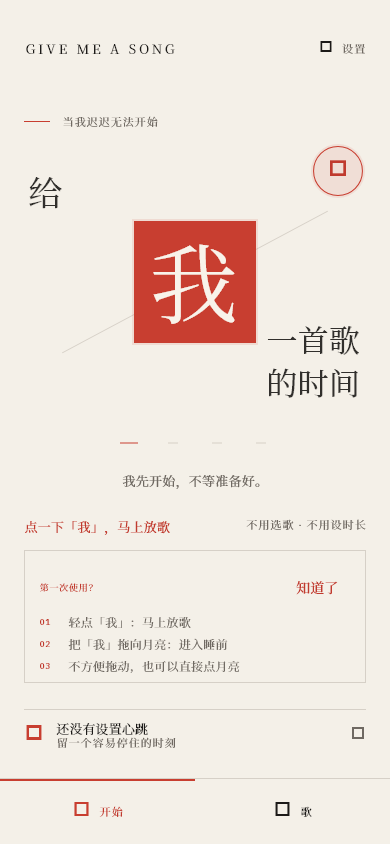
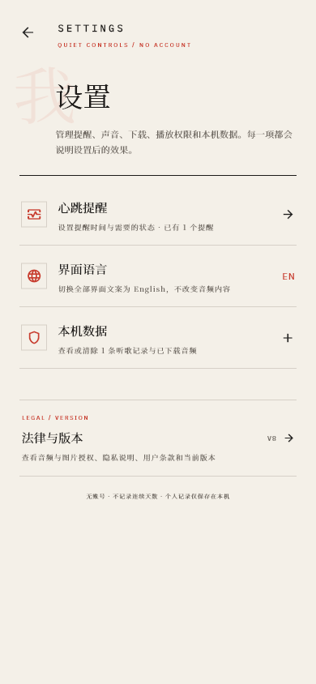

# 给我一首歌的时间 / Give Me a Song

> 轻点“我”，让一首足够长的歌先开始；也可以把“我”拖向月亮，进入睡前模式。

Give Me a Song 是一个本地优先的开始仪式。它不是要求你先完成计划、挑好歌或设定倒计时，而是先用一首歌打断停滞，让注意力有一个落点，再回到眼前的事情。

[前往 Releases 下载最新版本](../../releases/latest)

## 页面预览

  
  
  

  
  

## 它能做什么

- 轻点“我”，从应用歌单或自己的本地音频中开始一首歌。
- 把“我”拖向月亮，进入睡前模式。
- 在 Android 上保持后台与锁屏播放，并提供系统媒体控制。
- 设置定时心跳，或在 Android 上根据屏幕使用时长收到一次温和提醒。
- 保存听过的片段、留下一个词，并生成分享卡片。
- 支持中文与英文界面；不要求注册账号。

## 当前支持的平台

| 平台 | 状态 | 说明 |
| --- | --- | --- |
| Android | 支持 Preview | 提供正式签名 APK，最低 Android 7.0（API 24） |
| 华为 / 鸿蒙兼容设备 | 有条件支持 | 使用同一 Android APK，仅适用于仍支持安装 APK 的设备 |
| Windows x64 | 支持 Preview | 提供完整便携 ZIP，解压后运行 |
| HarmonyOS NEXT | 暂不提供 | 当前不是原生 HAP / ArkTS 应用 |
| iOS / iPadOS | 暂不提供 | 当前没有 Mac/Xcode 构建与签名环境 |
| macOS | 暂不提供 | 当前版本不构建、不测试、不发布 |

“华为 / 鸿蒙兼容设备”不等于 HarmonyOS NEXT 原生支持。如果设备已不能安装 Android APK，请不要下载本版本。

## 下载与安装

### Android 与兼容的华为设备

1. 在 [Releases](../../releases/latest) 下载 `Give-Me-a-Song-0.2.0+11-android.apk`。
2. 用浏览器或文件管理器打开 APK。
3. 按系统提示允许该来源安装应用。
4. 安装后首次播放时，根据需要开启通知，以显示后台和锁屏媒体控制。

APK 使用项目私有正式证书签名。后续正式版本会继续使用同一证书，以支持覆盖升级。

### Windows

1. 下载 `Give-Me-a-Song-0.2.0+11-windows-x64.zip`。
2. 将 ZIP 完整解压到一个新文件夹。
3. 运行 `give_me_a_song.exe`。

不能只复制 EXE；同目录的 DLL、`data` 和插件文件都必须保留。当前 Windows 版本尚未购买 Authenticode 代码签名证书，Windows 可能显示 SmartScreen 提示。请先核对 Release 页面公布的 SHA-256，再决定是否运行。

## 隐私

- [中文隐私政策](https://antsally9-dev.github.io/give-me-a-song-privacy/zh-CN/)
- [English Privacy Policy](https://antsally9-dev.github.io/give-me-a-song-privacy/en-US/)
- 发布者：`sally zhu`
- 支持邮箱：`antsally9@gmail.com`

App 不要求账号，不接入广告、跨 App 跟踪或产品分析 SDK。心跳设置、听歌记录、留下的词和用户导入的音频副本保存在本机。屏幕使用时长心跳只在本机计算并发送提醒，不会把使用记录上传，也不会在后台自动开始播放。

## 音乐、图片与版权

随包媒体已经逐项记录来源、授权或公有领域状态及文件哈希。对应来源和许可信息可在 App 的“法律与版本”以及媒体详情中查看。用户自行导入的音频不会上传，但用户仍需自行确认拥有使用该文件的权利。

本仓库只用于发布安装包和说明，不包含应用源代码，也不授予对应用代码、品牌或视觉设计的再分发许可。

## 版本状态

当前为 `0.2.0+11 Preview`，面向初期测试用户。已通过 361 项 Flutter 测试、静态分析、正式内容校验，以及 Android/Windows 发布元数据校验。

已知限制：

- Windows 安装包尚未进行商业代码签名。
- Android 后台提醒可能受到不同厂商省电策略影响。
- 目前只完成一台华为设备的完整后台屏幕时长心跳验证。
- 不提供 iOS、iPadOS、macOS 或 HarmonyOS NEXT 原生版本。

如果遇到问题，请附上设备型号、系统版本、App 版本和复现步骤，发送至 `antsally9@gmail.com`。

